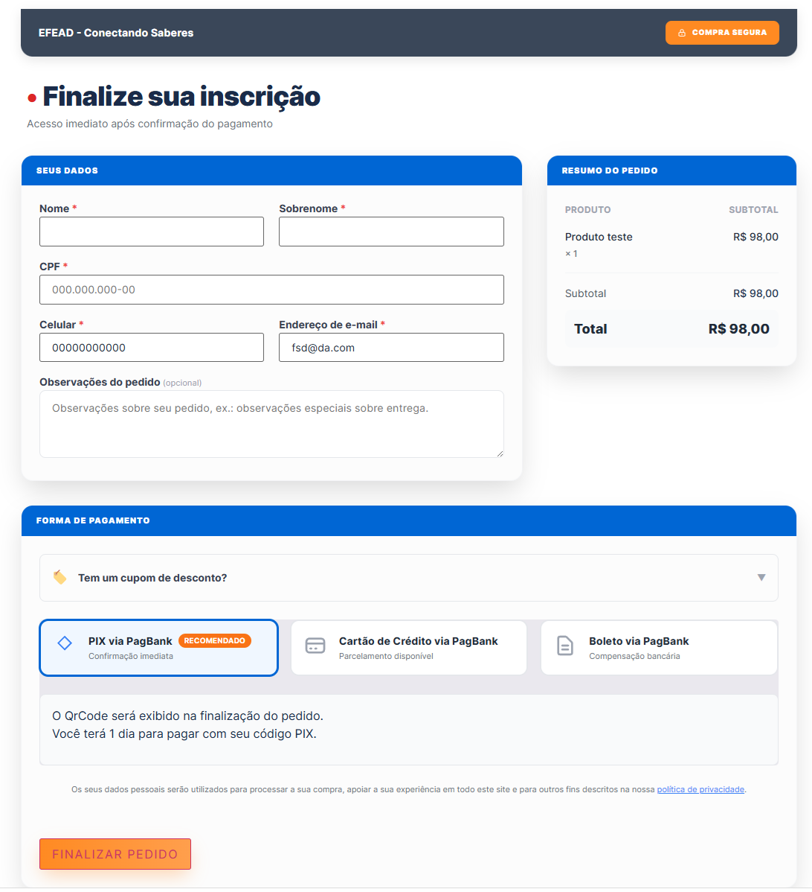

# 🛒 GVN Checkout for WooCommerce

[](https://wordpress.org)
[](https://woocommerce.com)
[](https://php.net)
[](https://www.gnu.org/licenses/gpl-2.0.html)

O **GVN Checkout for WooCommerce** substitui o fluxo de checkout padrão e monótono do WooCommerce por uma experiência de compra moderna, de alta conversão, responsiva e com um design premium totalmente otimizado para o mercado brasileiro.

## Base canônica

O diretório `checkout-woo` é a implementação canônica do **GVN Checkout for WooCommerce**. Novos recursos, correções, documentação e releases devem ser desenvolvidos e validados nesta base. O diretório `checkout-woo-2`, quando presente, é apenas referência histórica e não deve ser tratado como fonte canônica.

---

## 📸 Demonstração do Checkout

Abaixo está uma demonstração visual da interface limpa e moderna gerada pelo plugin:



---

## ✨ Principais Recursos

*   **⚡ Layout Otimizado para Conversão:** Design de página única (*one-page checkout*) limpo e focado no essencial para reduzir a taxa de abandono de carrinho.
*   **📱 Totalmente Responsivo:** Experiência de compra impecável tanto em dispositivos móveis quanto em computadores.
*   **🎨 Customização Completa:** Controle total de cores (cor primária, botões, cabeçalho e badges) diretamente nas configurações do painel.
*   **🛠️ Formulário Simplificado:** Foco apenas nos campos obrigatórios para o mercado brasileiro (Nome, Sobrenome, CPF, Celular, E-mail e Endereço).
*   **⚡ Autocompletar e Validação de CEP:**
    *   Preenchimento automático do endereço via consulta server-side ao ViaCEP.
    *   Cache inteligente via Transients do WordPress (válido por 7 dias) para evitar requisições repetidas e acelerar o checkout.
    *   Validação de consistência entre CEP e Estado (UF) para evitar erros de entrega.
    *   Campos de endereço travados após preenchimento automático para evitar digitação incorreta (com opção de edição manual caso necessário).
*   **🏷️ Cupom de Desconto Dinâmico:** Seção de cupom com toggle moderno que não distrai o cliente.
*   **🛍️ Order Bump Avançado:** Ofereça produtos adicionais com desconto diretamente no checkout e aumente o Ticket Médio (*AOV*) da sua loja com apenas 1 clique.
*   **🛡️ Máscaras Automáticas:** Formatação inteligente em tempo real nos campos de CPF e Celular.

---

## 🚀 Como Instalar

1.  Obtenha o arquivo compactado da release do plugin (`gvn-checkout.zip`).
2.  No painel do seu WordPress, vá em **Plugins > Adicionar Novo > Enviar Plugin**.
3.  Escolha o arquivo `.zip` e clique em **Instalar Agora**.
4.  Após a instalação, clique em **Ativar Plugin**.

---

## 🛠️ Como Usar

### 1. Criar a Página de Checkout
O plugin funciona através de um shortcode nativo.
1.  Vá em **Páginas > Adicionar Nova** no WordPress.
2.  Insira o shortcode abaixo no conteúdo da página:
    ```text
    [gvn-checkout]
    ```
3.  Publique a página.

> [!TIP]
> Para que os clientes sejam redirecionados corretamente, lembre-se de configurar esta nova página como a página oficial de checkout em **WooCommerce > Configurações > Avançado > Página de checkout**.

### 2. Configurar o Plugin
Todas as opções visuais e de comportamento do checkout podem ser customizadas de forma simples:
1.  Vá em **WooCommerce > Configurações**.
2.  Clique na aba **GVN Checkout**.
3.  Personalize as seguintes seções de acordo com a identidade visual da sua marca:
    *   **Identidade Visual:** Defina a Cor Primária, Cor dos Botões e Texto do Botão de Finalização.
    *   **Cabeçalho (Header):** Ative ou desative o cabeçalho personalizado, defina o título (ex: nome da sua loja), o texto da badge de segurança e as cores do topo.
    *   **Order Bump:** Escolha o produto que deseja oferecer como oferta exclusiva, configure o título atrativo, a descrição da oferta, o preço especial e o texto de chamada para ação (CTA).

---

## Referência da superfície pública atual (baseline F0.3)

Este inventário registra o comportamento observado no código canônico antes da refatoração estrutural. Ele corresponde ao commit `688d85327dbacd92fce105c6eca6796a6ce5cd55` e à versão `1.13.5`; a versão `1.13.6` atualiza somente documentação e metadados, a versão `1.13.7` adiciona somente uma fixture sintética para migração, a versão `1.13.8` define a política de rollback, a versão `1.13.9` sincroniza os comentários de versão, a versão `1.13.10` remove os arquivos compactados do controle de versão, a versão `1.13.11` adiciona aviso administrativo de conflito, a versão `1.13.12` expande as fixtures de migração e clean install, a versão `1.13.13` adiciona seed reproduzível do catálogo, a versão `1.13.14` registra o threat model operacional, a versão `1.13.15` adiciona os ADRs, a versão `1.13.16` estabelece o protocolo de anonimização, e a versão `1.13.17` formaliza a política de concorrência de deploy. A presença de um item nesta lista não é, sozinha, evidência de compatibilidade ou suporte.

### Shortcode

| Shortcode | Atributos observados | Comportamento atual |
| --- | --- | --- |
| `[gvn-checkout]` | Nenhum atributo documentado ou processado | Renderiza o checkout personalizado para o carrinho atual. Se o carrinho estiver vazio, exibe o estado vazio; se o checkout de convidado estiver desativado, solicita login. Em `order-received`, renderiza o template customizado de confirmação. |

O shortcode usa o formulário e o processamento nativos do WooCommerce. `product_id`, `layout` e outros atributos presentes no projeto histórico `checkout-woo-2` não fazem parte do shortcode canônico e não devem ser tratados como compatíveis.

### Opções persistidas pelo plugin

As opções abaixo usam o prefixo `gvn_checkout_` e são gravadas pela tela **WooCommerce > Configurações > GVN Checkout**, pela ativação ou pelo gerenciador de campos. Os valores são os defaults observados no código; a opção pode não existir em instalações antigas, caso em que o template aplica seu fallback de leitura.

| Opção | Tipo/valores observados | Default observado | Finalidade |
| --- | --- | --- | --- |
| `gvn_checkout_header_text` | Texto | `EFEAD - Conectando Saberes` | Texto principal do cabeçalho. |
| `gvn_checkout_header_badge_text` | Texto | `COMPRA SEGURA` | Texto do badge do cabeçalho. |
| `gvn_checkout_header_bg_color` | Cor | `#3a4759` | Cor de fundo do cabeçalho. |
| `gvn_checkout_badge_bg_color` | Cor | `#ff8a22` | Cor de fundo do badge. |
| `gvn_checkout_title_text` | Texto | `Finalize sua inscrição` | Título acima do formulário. Não é inicializada pela rotina de ativação, mas possui default na tela/template. |
| `gvn_checkout_subtitle_text` | Texto | `Acesso imediato após confirmação do pagamento` | Subtítulo acima do formulário. Não é inicializada pela rotina de ativação, mas possui default na tela/template. |
| `gvn_checkout_primary_color` | Cor | `#0066d4` | Cor primária de seções e destaques. |
| `gvn_checkout_button_color` | Cor | `#ff8a22` | Cor do botão de finalização. |
| `gvn_checkout_button_text` | Texto | `Finalizar pedido` | Texto/valor do botão de finalização. |
| `gvn_checkout_order_bump_enabled` | `yes`/`no` | `no` | Habilita a oferta adicional. |
| `gvn_checkout_order_bump_product_id` | ID inteiro de produto | vazio/`0` | Produto usado no order bump. |
| `gvn_checkout_order_bump_title` | Texto | `Oferta Exclusiva` | Título da oferta. |
| `gvn_checkout_order_bump_description` | Texto/textarea | `Adicione este item ao seu pedido com condições especiais.` | Descrição da oferta; o fallback do template pode ser vazio quando a opção não existir. |
| `gvn_checkout_order_bump_cta_text` | Texto | `Sim! Quero adicionar ao meu pedido` | Texto da chamada para ação. |
| `gvn_checkout_order_bump_price` | Decimal textual ou vazio | vazio | Preço promocional; vazio ou valor não positivo faz o item usar o preço padrão. |
| `gvn_checkout_fields` | Array de definições de campo | Defaults internos | Schema unificado dos campos exibidos e processados. |
| `gvn_checkout_default_fields_config` | Array legado | — | Configuração antiga de campos brasileiros, lida somente pela migração administrativa e removida após o processamento. Não é uma opção de configuração nova. |

A opção nativa do WooCommerce `woocommerce_enable_guest_checkout` também é lida pelo plugin para decidir se um visitante pode renderizar o checkout. Ela pertence ao WooCommerce e não deve ser confundida com uma opção GVN.

### Schema atual de `gvn_checkout_fields`

Cada entrada do array pode conter as seguintes chaves:

| Chave | Valores observados | Observação |
| --- | --- | --- |
| `key` | Chave sanitizada, por exemplo `billing_cpf` | Identificador enviado no checkout e base da meta customizada. |
| `label` | Texto | Rótulo exibido no formulário e no admin do pedido. |
| `type` | `text`, `email`, `tel`, `number`, `textarea`, `select`, `date`, `password` | Allowlist exposta pelo gerenciador atual. |
| `required` | Booleano | Obrigatoriedade declarada; campos condicionais são registrados no WooCommerce como não obrigatórios. |
| `width` | `25`, `33`, `50`, `75`, `100` | Largura visual em percentual. |
| `position` | Inteiro | Ordem do campo. |
| `placeholder` | Texto | Placeholder visual. |
| `enabled` | Booleano | Controla se o campo entra na lista efetiva. |
| `mask` | vazio, `cpf`, `cnpj`, `phone`, `cep`, `date`, `rg` | Máscara visual aplicada pelo JavaScript. |
| `is_default` | Booleano | Identifica campo brasileiro/default do plugin. |
| `is_woo_default` | Booleano | Identifica campo nativo importado do WooCommerce. |
| `options` | Uma opção por linha, `valor|Rótulo` ou somente `Rótulo` | Usado principalmente por `select`. |
| `default_option` | Valor existente em `options` ou vazio | Seleção inicial; valores inexistentes são descartados ao salvar. |
| `conditions` | `{ logic: 'and'|'or', rules: [] }` | Regras de exibição; operadores atuais: `equals`, `not_equals`, `filled`, `empty`, `contains`, `greater`, `less`. |

Os campos default cadastrados no código são: `billing_first_name`, `billing_last_name`, `billing_persontype`, `billing_cpf`, `billing_rg`, `billing_cnpj`, `billing_ie`, `billing_phone`, `billing_cellphone`, `billing_email`, `billing_birthdate`, `billing_gender`, `billing_number`, `billing_neighborhood`, `shipping_number`, `shipping_neighborhood` e `order_comments`. Por default, ficam habilitados `billing_first_name`, `billing_last_name`, `billing_cpf`, `billing_phone`, `billing_email` e `order_comments`; os demais podem ser habilitados pelo gerenciador.

Quando não estão na lista visual, alguns campos nativos de endereço (`billing_country`, `billing_address_1`, `billing_address_2`, `billing_city`, `billing_state`, `billing_postcode` e `billing_company`) são renderizados pelo template como inputs ocultos. Isso é comportamento atual do baseline, não um contrato para integrações futuras.

### Hooks e filtros registrados

O plugin registra os seguintes pontos de integração. Os métodos das classes `GVN_*` são detalhes internos; os nomes de hooks, shortcode e ações AJAX são a superfície observável.

#### WordPress e administração

- `plugins_loaded` → inicializa os módulos depois que os plugins foram carregados.
- `before_woocommerce_init` → declara HPOS (`custom_order_tables`) como compatível e Cart/Checkout Blocks (`cart_checkout_blocks`) como incompatível.
- `admin_notices` → exibe aviso quando o WooCommerce não está ativo.
- `wp_enqueue_scripts` → carrega CSS/JS quando a página contém o shortcode ou é um endpoint `order-received`.
- `admin_enqueue_scripts` → carrega assets da tela administrativa da aba `gvn_checkout`.
- `admin_init` → tenta migrar `gvn_checkout_default_fields_config` para `gvn_checkout_fields` quando o usuário possui `manage_woocommerce`.
- `woocommerce_settings_tabs_array` (prioridade 50) → adiciona a aba `gvn_checkout` às configurações do WooCommerce.
- `woocommerce_settings_tabs_gvn_checkout` → renderiza as sub-abas de configurações, campos e ajuda.
- `woocommerce_update_options_gvn_checkout` → grava as configurações da sub-aba principal pela API de settings do WooCommerce.
- `plugin_action_links_{GVN_CHECKOUT_PLUGIN_BASENAME}` → adiciona o link de configurações na lista de plugins.
- `register_activation_hook()` → grava defaults das opções na ativação sem substituir valores já existentes.
- `register_deactivation_hook()` → limpa transients de CEP na desativação.

#### Checkout, carrinho e pedido

- `woocommerce_checkout_fields` (prioridade 20) → registra campos habilitados no checkout e marca campos nativos não configurados como ocultos.
- `woocommerce_before_checkout_billing_form` → é disparado pelo template antes dos campos dinâmicos, recebendo o objeto `$checkout`.
- `woocommerce_after_checkout_billing_form` → é disparado pelo template depois dos campos dinâmicos, recebendo o objeto `$checkout`.
- `woocommerce_checkout_update_order_meta` → salva metas de campos habilitados não nativos; recebe o ID do pedido. Este é o hook legado atualmente observado.
- `woocommerce_after_checkout_validation` (10, 2 argumentos) → valida CEP, UF, consistência CEP/UF e cidade.
- `woocommerce_checkout_create_order` (10, 2 argumentos) → normaliza UF, cidade, CEP e endereço antes da persistência do pedido.
- `woocommerce_before_calculate_totals` (prioridade 20) → aplica o preço configurado ao item marcado como order bump.
- `woocommerce_admin_order_data_after_billing_address` → exibe metas customizadas no endereço de cobrança do admin.
- `woocommerce_admin_order_data_after_shipping_address` → exibe metas customizadas no endereço de entrega do admin.
- `wc_get_template` (10, 5 argumentos) → o baseline intercepta `checkout/thankyou.php` e pode apontar para o template customizado de confirmação.
- `woocommerce_thankyou_{payment_method}` → é disparado pelo template customizado para as instruções do gateway, com o ID do pedido.
- `woocommerce_thankyou` → é disparado pelo template customizado depois do hook específico do gateway, com o ID do pedido.

O plugin não define atualmente hooks próprios por `do_action( 'gvn_*' )` ou filtros próprios equivalentes. Os hooks de extensão observados são os do WordPress/WooCommerce acima.

### Ações AJAX e contrato observado

As ações usam `admin-ajax.php`. Ações com `wp_ajax_nopriv_` também podem ser chamadas por convidados; o nonce reduz CSRF, mas não substitui sessão, validação server-side, capability ou idempotência.

| Ação | Acesso | Dados observados | Resultado |
| --- | --- | --- | --- |
| `gvn_apply_coupon` | Logado e convidado | `nonce` (`gvn_checkout_nonce`), `coupon_code` | Aplica pela `WC()->cart`, retorna mensagem, total, subtotal e desconto. |
| `gvn_remove_coupon` | Logado e convidado | `nonce` (`gvn_checkout_nonce`), `coupon_code` | Remove pela `WC()->cart`, recalcula e retorna mensagem, total e subtotal. |
| `gvn_toggle_order_bump` | Logado e convidado | `nonce` (`gvn_checkout_nonce`), `bump_action` (`add`/`remove`) | Adiciona/remove o produto configurado pela API do carrinho e retorna itens/totais renderizados. |
| `gvn_cep_lookup` | Logado e convidado | `nonce` (`gvn_checkout_nonce`), `cep` | Aceita oito dígitos, consulta ViaCEP no servidor, usa cache e retorna dados normalizados. |
| `gvn_save_fields` | Usuário com `manage_woocommerce` | `nonce` (`gvn_admin_fields_nonce`), `fields` como JSON | Sanitiza e grava `gvn_checkout_fields`; não possui variante `nopriv`. |

A finalização do pedido não usa uma ação AJAX própria do GVN: o formulário mantém a action e o nonce nativos do WooCommerce (`woocommerce-process_checkout`), e o gateway continua responsável pelo processamento de pagamento e redirecionamento.

### Dados JavaScript localizados

- `gvn_checkout_params` é localizado no script `gvn-checkout-js` com `ajax_url`, `nonce` (`gvn_checkout_nonce`) e `wc_ajax_url`.
- `gvn_admin_params` é localizado no script `gvn-admin-fields-js` com `ajax_url` e `nonce` (`gvn_admin_fields_nonce`); só é carregado na tela administrativa da aba `gvn_checkout`.
- Depois de alterações de cupom ou order bump, o JavaScript dispara o evento nativo do WooCommerce `update_checkout`. O plugin não define eventos JavaScript próprios documentados.

### Metadados, carrinho e cache

- **Campos do pedido:** campos nativos de billing/shipping e `order_comments` ficam sob responsabilidade do WooCommerce. Campos habilitados não nativos são gravados pelo plugin com `WC_Order::update_meta_data()` e chave `_{field_key}`, por exemplo `_billing_cpf` ou `_{custom_key}`.
- **Leitura no pós-pedido:** o template lê `_billing_cpf` e as metas `_{field_key}` para exibição da confirmação e do admin. Não existe no baseline um marcador de origem do pedido ou versão de schema gravado na ordem.
- **Order bump:** o item adicionado ao carrinho recebe o marcador `gvn_order_bump` nos dados do item. O código do plugin não grava uma meta de pedido própria para esse marcador.
- **CEP:** o resultado normalizado é guardado em transient com chave `gvn_cep_{cep}` por `604800` segundos (7 dias); os nomes internos correspondentes usam os prefixos `_transient_gvn_cep_` e `_transient_timeout_gvn_cep_`.
- **Desinstalação:** `uninstall.php` remove as opções GVN conhecidas, incluindo a opção legada de campos, e limpa os transients de CEP. Não há user meta, cookie ou `localStorage` próprio documentado no código atual.
- **Schema:** não foi encontrada opção de versão de schema, estado de migração ou registry no baseline.

### Identificadores internos

`GVN_CHECKOUT_VERSION`, `GVN_CHECKOUT_PLUGIN_DIR`, `GVN_CHECKOUT_PLUGIN_URL`, `GVN_CHECKOUT_PLUGIN_BASENAME`, as funções globais `gvn_checkout_*` e as classes `GVN_*` existem no bootstrap atual para composição interna. Não são uma API pública documentada; integrações devem preferir os shortcodes, opções e hooks oficiais listados acima.

### Limitações do baseline

- O shortcode canônico não aceita atributos de produto ou layout.
- O filtro `wc_get_template` é registrado de forma ampla e o template de confirmação customizado não possui marcador de origem do pedido no baseline.
- O carregamento de assets identifica páginas pelo conteúdo do post com `has_shortcode()`.
- A lista de produtos do order bump é limitada a 100 itens no admin.
- O plugin declara HPOS compatível e Blocks incompatível, mas a matriz de testes de HPOS ainda não foi executada.

Essas limitações foram registradas para orientar fases posteriores e não são corrigidas nesta tarefa documental.

---

## 🔒 Requisitos do Sistema

*   **WordPress:** 6.0 ou superior.
*   **WooCommerce:** 7.0 ou superior.
*   **PHP:** 7.4 ou superior.
*   **Gateways de Pagamento:** Compatível com os principais gateways de pagamento do mercado brasileiro que operam de forma nativa na finalização do WooCommerce.

---

## 📄 Licença

Este plugin é distribuído sob a licença **GPL-2.0+**. Sinta-se livre para usá-lo, modificá-lo e compartilhá-lo.
